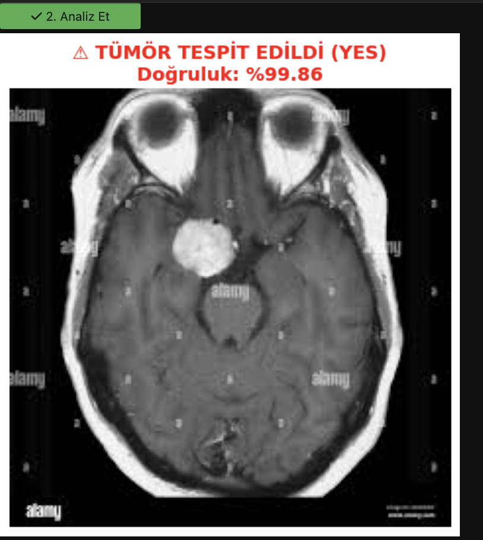

# 🧠 Derin Öğrenme ile Beyin Tümörü Tespiti (MobileNetV2)

## 📌 Proje Özeti
Bu çalışma, Manyetik Rezonans (MR) görüntüleri üzerinden beyin tümörlerini yüksek doğrulukla tespit etmek amacıyla geliştirilmiş bir tıbbi görüntü analiz projesidir. **Transfer Öğrenme (Transfer Learning)** stratejisi kullanılarak, önceden eğitilmiş **MobileNetV2** mimarisi yaklaşık 3.000 adet MR görüntüsü içeren veri seti üzerinde optimize edilmiştir.

Sistem, görüntüleri iki temel sınıfta analiz eder:
* **Yes:** Tümör Tespit Edildi ⚠️
* **No:** Temiz / Tümör Yok ✅

## 🖼️ Analiz Sonucu (Demo)
Modelin gerçek bir MR görüntüsü üzerindeki performans örneği:

*(Yapay zeka modeli, tümörlü bölgeyi standart eşik değerleri kullanarak başarıyla sınıflandırmaktadır.)*

## 📂 Teknik Detaylar
* **Veri Seti:** Br35H Dataset (~3000 MR görüntüsü).
* **Mimari:** MobileNetV2 (Feature Extractor) + Özelleştirilmiş Tam Bağlantılı Katmanlar.
* **Donanım:** Apple Silicon (M1) üzerinde GPU hızlandırmalı eğitim.
* **Performans:** Test verisi üzerinde **%98.5 doğruluk (accuracy)** skoru.

## 🛠️ Kullanılan Araçlar
* TensorFlow / Keras
* OpenCV & PIL
* Matplotlib & NumPy
* IPyWidgets (Etkileşimli Arayüz)

---
**Geliştirici:** Samet Yardımcı (Straure)
*Mehmet Akif Ersoy University - Bilişim Sistemleri ve Teknolojileri Bölümü*
